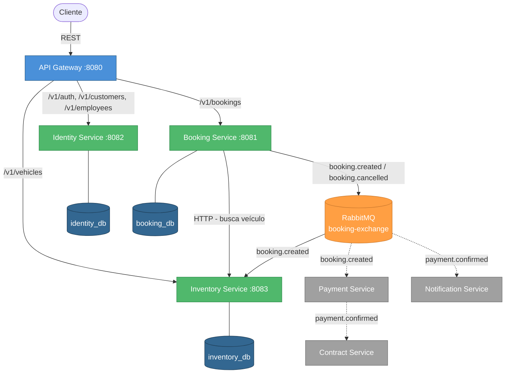

****# Car Rental System

Backend para aluguel de carros construído com arquitetura de microsserviços, Java 21, Spring Boot e comunicação assíncrona via RabbitMQ.

---

## Arquitetura



> Linhas tracejadas representam serviços **planejados**.

### Fluxo de uma reserva

```mermaid
sequenceDiagram
    actor C as Cliente
    participant GW as API Gateway
    participant BK as Booking Service
    participant INV as Inventory Service
    participant MQ as RabbitMQ
    participant PAY as Payment Service
    participant CT as Contract Service
    participant NT as Notification Service

    C->>GW: POST /v1/bookings
    GW->>GW: Valida JWT
    GW->>BK: Encaminha request
    BK->>INV: GET /v1/vehicles/details/{id}
    INV-->>BK: Dados do veículo
    BK->>BK: Verifica conflitos e calcula valor
    BK-->>GW: 201 Created
    GW-->>C: Reserva criada

    BK--)MQ: booking.created
    MQ--)INV: booking.created
    INV->>INV: Marca veículo como RENTED

    Note over PAY,NT: Serviços planejados

    MQ---)PAY: booking.created
    PAY->>PAY: Cria cobrança PENDING
    PAY--)MQ: payment.confirmed
    MQ---)CT: payment.confirmed
    CT->>CT: Gera PDF do contrato
    MQ---)NT: payment.confirmed
    NT->>NT: Envia e-mail ao cliente
```

---

## Microsserviços

| Serviço      | Porta | Status        | Responsabilidade                          |
|--------------|-------|---------------|-------------------------------------------|
| gateway      | 8080  | ✅ Implementado | Roteamento, autenticação JWT              |
| inventory    | 8083  | ✅ Implementado | Cadastro e gestão de veículos             |
| booking      | 8081  | ✅ Implementado | Reservas, cancelamentos, conflitos        |
| identity     | 8082  | ✅ Implementado | Clientes, funcionários, autenticação      |
| notification | —     | 🔲 Planejado   | Envio de e-mails e notificações           |
| payment      | —     | 🔲 Planejado   | Processamento de pagamentos               |
| contract     | —     | 🔲 Planejado   | Geração de contratos em PDF               |

---

## Stack

- **Java 21** + **Spring Boot 4**
- **PostgreSQL** — banco por serviço (isolamento de dados)
- **RabbitMQ** — comunicação assíncrona entre serviços
- **Spring Data JPA** + Hibernate
- **Spring AMQP** — produtores e consumidores de eventos
- **Lombok** — redução de boilerplate
- **Spring Cloud Gateway (MVC)** — API Gateway com roteamento e filtros
- **JWT (java-jwt)** — autenticação via token no gateway
- **Maven** — build e gerenciamento de dependências

---

## Padrões aplicados

- **Clean Architecture** — domain / application / infra
- **DDD** — entidades, value objects, eventos de domínio
- **Event-Driven Architecture** — TopicExchange com routing keys
- **Factory Pattern** — criação de tipos de veículo (EconomicCar, SuvCar)
- **Specification Pattern** — filtros dinâmicos com JPA Specifications
- **Repository Pattern** — Spring Data JPA
- **SOLID**

---

## Como executar

> Pré-requisitos: Docker, Java 21, Maven

```bash
# 1. Subir infraestrutura (PostgreSQL + RabbitMQ)
docker-compose up -d

# 2. Identity Service
cd identity && ./mvnw spring-boot:run

# 3. Inventory Service (em outro terminal)
cd inventory && ./mvnw spring-boot:run

# 4. Booking Service (em outro terminal)
cd booking && ./mvnw spring-boot:run

# 5. Gateway (em outro terminal)
cd gateway && ./mvnw spring-boot:run
```

---

## Endpoints disponíveis

> Todas as requisições passam pelo **Gateway** (`localhost:8080`).
> Rotas `/v1/auth/**` são públicas. As demais exigem header `Authorization` com JWT válido.

### Identity Service — `/v1/auth`, `/v1/customers`, `/v1/employees`

```
POST   /v1/auth                Autenticação (login)
GET    /v1/customers           Listar clientes
GET    /v1/employees           Listar funcionários
```

### Inventory Service — `/v1/vehicles`

```
POST   /v1/vehicles            Cadastrar veículo
GET    /v1/vehicles            Listar veículos
GET    /v1/vehicles/details/{id}  Buscar veículo por ID
```

### Booking Service — `/v1/bookings`

```
POST   /v1/bookings            Criar reserva
GET    /v1/bookings            Listar reservas (filtros: customerId, vehicleId)
DELETE /v1/bookings/{id}       Cancelar reserva
```

---

## Estrutura do projeto

```
car-rental/
├── gateway/          ✅ Roteamento e autenticação JWT
├── identity/         ✅ Clientes, funcionários e auth
├── inventory/        ✅ Veículos e listeners
├── booking/          ✅ Reservas e eventos
├── notification/     🔲 A implementar
├── payment/          🔲 A implementar
├── contract/         🔲 A implementar
├── docker-compose.yml
└── roadmap.sh
```
